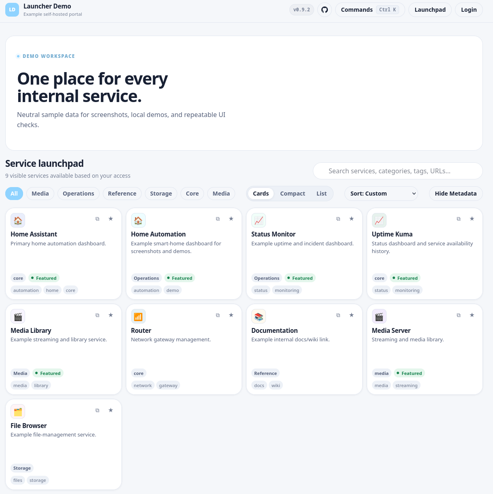
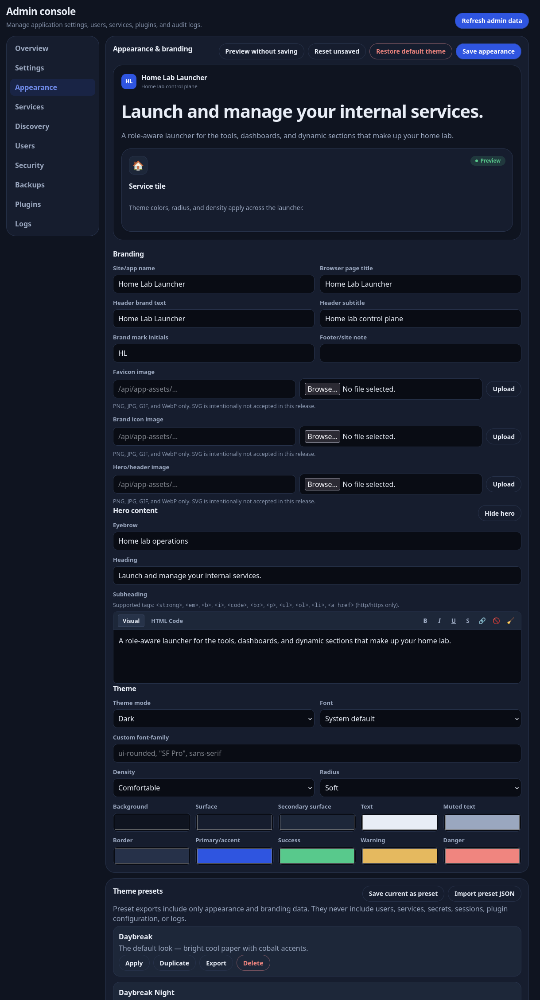
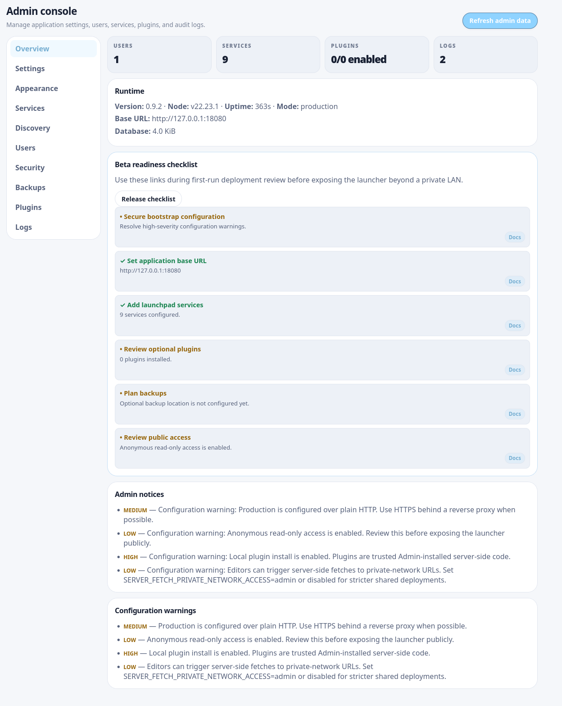
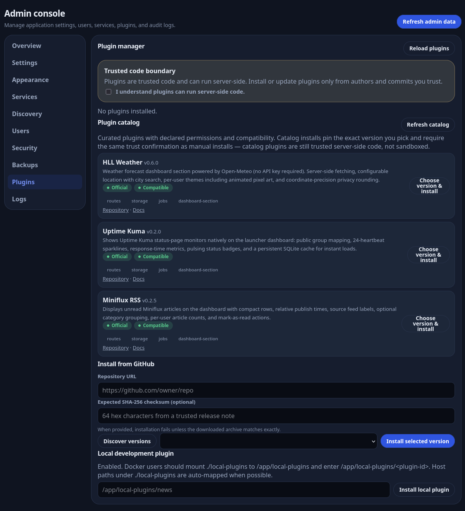

<div align="center">

# 🏠 Home Lab Launcher

**One beautiful front door for everything running in your home lab.**

A self-hosted, role-aware portal for your services — with favorites, health checks,
service discovery, theming, and a trusted plugin system. Docker-first, SQLite-backed,
no cloud required.


[Quick start](#quick-start) · [Features](#what-you-get) · [Plugins](#plugins) · [Deployment guide](docs/deployment.md) · [Plugin docs](docs/plugins.md) · [API](docs/api.md)



</div>

> [!WARNING]
> Home Lab Launcher is in **public beta**. It works, we run it, but it's pre-1.0 — review the [security notes](#security) before exposing it beyond a private LAN, and back up your data volume before upgrading.

---

## Why?

If you run a home server, you know the drill: Jellyfin on one port, Home Assistant on another, Uptime Kuma somewhere, three things behind Traefik, and a browser bookmark folder that nobody else in the house can find.

Home Lab Launcher turns that sprawl into a single polished launchpad:

- **It's for the whole household, not just you.** Role-based access (Admin / Editor / Basic User / optional anonymous read-only) means your family gets a clean page of links while you keep the admin console to yourself.
- **It fills itself in.** Point service discovery at a Docker socket proxy — or paste your Compose YAML — and import your running services instead of typing them out one by one.
- **It tells you what's down.** Per-service HTTP health checks with uptime history and webhook notifications (ntfy, Gotify, and Discord work out of the box).
- **It looks the way you want.** Full theming — branding, hero copy, colors, fonts, density — with exportable, safely shareable theme presets.
- **It grows with your lab.** A trusted plugin system adds weather, RSS, status widgets, or your own custom dashboard sections.
- **It stays portable.** One container, one SQLite database, one Docker volume. No baked-in domains, no external dependencies, easy to back up.

## Quick start

The fastest path is the guided installer — it checks for Docker + Compose v2, prompts for the basics, generates `docker-compose.yml` and `.env`, and can start the launcher for you:

```bash
# Linux
curl -fsSL https://raw.githubusercontent.com/TMASoft/home-lab-launcher/main/install/linux.sh | sh

# macOS
curl -fsSL https://raw.githubusercontent.com/TMASoft/home-lab-launcher/main/install/macos.sh | sh
```

(Prefer to inspect scripts before running them? Good instinct — download it first and run it with `sh`.) The installer can also add a basic bundled Nginx reverse proxy if you don't already run one; that option is HTTP-only, so put a TLS-capable proxy in front before exposing the launcher beyond a private LAN.

### Manual setup

**1. Clone and configure**

```bash
git clone https://github.com/TMASoft/home-lab-launcher.git
cd home-lab-launcher
cp .env.example .env
```

Edit `.env` before first start — at minimum set a strong session secret and the URL users will open:

```bash
openssl rand -hex 48   # generate a session secret
```

```env
SESSION_SECRET=replace-with-a-long-random-string
APP_BASE_URL=http://localhost:8080
```

**2. Start it**

For a tagged release, use the official GHCR image:

```bash
APP_IMAGE=ghcr.io/TMASoft/home-lab-launcher:v0.9.3 docker compose pull launcher
APP_IMAGE=ghcr.io/TMASoft/home-lab-launcher:v0.9.3 docker compose up -d --no-build
```

Or build from source: `docker compose up --build -d`

**3. Open it**

Visit `http://localhost:8080`. The first page load walks you through creating the Admin account in the browser (with optional TOTP 2FA right from setup). Prefer non-interactive bootstrap? Set `BOOTSTRAP_ADMIN_USERNAME` and `BOOTSTRAP_ADMIN_PASSWORD` in `.env` before first start, then change or remove that password after login. Usernames need 3+ characters, passwords 10+.

After first login, open **Admin → Overview** and run through the beta readiness checklist. To sanity-check the deployment:

```bash
curl -fsS http://localhost:8080/api/healthz           # { ok, version, uptimeSeconds }
curl -fsS http://localhost:8080/api/bootstrap-status  # is first-admin setup still needed?
```

Data lives in the `launcher-data` Docker volume and persists across rebuilds. (Repeating a clean first-launch test locally? `docker compose down -v` wipes it — never on a real deployment.)

<details>
<summary><strong>Ports and reverse proxies</strong></summary>

The container listens on `8080` internally. To publish a different host port:

```env
HOST_PORT=9090
APP_BASE_URL=http://localhost:9090
```

Behind Nginx, Caddy, Traefik, or another same-host reverse proxy, bind to loopback only:

```env
HOST_BIND_IP=127.0.0.1
HOST_PORT=8080
TRUST_PROXY=loopback
APP_BASE_URL=https://launcher.example.test
```

`HOST` controls the interface the Node process listens on *inside* the container and normally stays `0.0.0.0`. Standard Docker bridge networking is the supported default; if a constrained Docker/LXC environment forces host networking, set `HOST=127.0.0.1`, keep the app behind a same-host reverse proxy, and keep that override out of the public Compose file.

Home Lab Launcher deliberately does **not** issue or manage TLS certificates — run it over direct HTTP on a private LAN, or put it behind Nginx, Caddy (ACME), Traefik, or any proxy you already trust. See [docs/deployment.md](docs/deployment.md) for worked examples.

</details>

## What you get

### 🚀 A launchpad your household will actually use

Card, compact, and list views with search (`/`), category filters, drag-to-reorder, grouping, tags, colors, and emoji or image icons (pasted image URLs are downloaded and stored locally — no hotlinking). Logged-in users keep their own favorites, ordering, layout, and hidden categories; anonymous visitors (when enabled) get the same preferences stored in their browser. Fully responsive — filters stack into touch-friendly rows on phones, nothing scrolls sideways.

Press `Ctrl+K` / `Cmd+K` for a **command palette** that respects roles: Basic Users get open/copy/favorite commands, Editors add service management, Admins add admin tabs, backups, logs, and plugin actions.

### 🔍 Service discovery — stop typing URLs

Scan running containers through a read-only Docker socket proxy, or paste `docker-compose.yml` content, and review import candidates in **Admin → Discovery**. Candidates are built from container names, images, published ports, `home-lab-launcher.*` / `homepage.*` labels, and Traefik ``Host(`…`)`` rules. Environment values, `env_file`, `secrets`, and secret-like labels are **never read**, and embedded credentials are stripped from URLs. Nothing imports until you review it — conflicts are detected, every candidate is editable, and every scan and import is audit-logged. Label a container `home-lab-launcher.ignore: "true"` to keep it out of scans.

### 💓 Health checks and notifications

Enable per-service HTTP health checks with configurable intervals and URL overrides. Cards show live status, response time, and error details; every sample feeds a history table (1–90 day retention) that powers a 24-hour uptime percentage. Configure a webhook to get a JSON POST on every up↔down transition — the payload includes `title`/`message`/`priority` (ntfy, Gotify) plus `content` (Discord), so most receivers work without an adapter.

### 🎨 Theming and branding

Admins control the global look from **Admin → Appearance**: app name, favicon, brand images, hero copy, dark/light/system mode, colors, fonts, density, and corner radius — with live preview. Save the result as a preset and export it as shareable JSON (`home-lab-launcher-theme-v1`) that contains *only* appearance data — never users, services, secrets, or plugin config. Imports are validated and sanitized before they can be applied.



### 👥 Roles that match a real household

| Role | View | Favorites | Manage services | Plugin settings | Install plugins | Users / settings / logs |
| --- | :-: | :-: | :-: | :-: | :-: | :-: |
| **Admin** | ✅ | ✅ | ✅ | ✅ | ✅ | ✅ |
| **Editor** | ✅ | ✅ | ✅ | Editor-safe fields | — | — |
| **Basic User** | ✅ | ✅ | — | User-safe preferences | — | — |
| **Anonymous** | Optional | Browser-local | — | — | — | — |

Anonymous read-only access is off by default and toggled in **Admin → Settings**.

### 🛠️ A real admin console



Everything an operator needs, in one place: overview with readiness checks and notices · settings · appearance · services (bulk actions, import/export, drag ordering) · discovery · users (roles, password/2FA resets) · security (sessions, effective config, deployment warnings) · backups (portable config backup + SQLite export/restore) · plugins · filtered audit logs with JSON export and retention controls.

Every user gets profile self-service too: password changes, TOTP 2FA with ten single-use recovery codes (shown exactly once, regenerable), active-session review, and session revocation. Admins can additionally issue **API tokens** for automation — role-scoped bearer tokens (`Authorization: Bearer hll_…`) with optional expiry, last-used tracking, and instant revocation, audit-logged as `token:<name>`.

## Plugins

Plugins are trusted, Admin-installed code that can add backend routes, SQLite migrations, scheduled jobs, frontend assets, and movable dashboard sections. The portal stays clean by default — empty plugin sections are hidden from regular viewers until something is installed.

Browse the **curated catalog** (trust status, declared permissions, compatibility, update hints) or install a pinned version straight from GitHub releases/tags. Installs always require an explicit trust acknowledgement, support optional SHA-256 checksum verification, show release notes, and roll back automatically if a new version fails to load. Plugin config fields are role-scoped by the manifest, and a local development mode makes writing your own plugin painless.

Official plugins so far: [hll-weather](https://github.com/TMASoft/hll-weather) · [hll-uptime-kuma](https://github.com/TMASoft/hll-uptime-kuma) · [hll-miniflux](https://github.com/TMASoft/hll-miniflux) — cataloged in [home-lab-launcher-plugins](https://github.com/TMASoft/home-lab-launcher-plugins), which also hosts plugin-author docs.

Want to build one? Start with [docs/plugins.md](docs/plugins.md).



## Configuration

Most settings are environment variables on first boot, then editable in the Admin console where applicable.

<details>
<summary><strong>Environment variable reference</strong></summary>

| Variable | Purpose | Default/example |
| --- | --- | --- |
| `HOST_PORT` | Host port published by Docker Compose | `8080` |
| `HOST_BIND_IP` | Host interface for the published Docker port; use `127.0.0.1` behind a local reverse proxy | `0.0.0.0` |
| `HOST` | Interface the Node process listens on inside the container/native process | `0.0.0.0` |
| `TRUST_PROXY` | Express reverse-proxy trust setting. Keep `false` for direct exposure; use `loopback` or `1` behind a trusted same-host/single reverse proxy | `false` |
| `PORT` | App port inside the container or native Node process | `8080` |
| `APP_NAME` | Initial displayed application name | `Home Lab Launcher` |
| `APP_BASE_URL` | External URL users open in a browser; set this to the reverse-proxy HTTPS URL when proxied | `http://localhost:8080` |
| `SESSION_SECRET` | Required session signing secret; generate a long random value before deployment | Change this |
| `SESSION_MAX_AGE_DAYS` | Session lifetime in days (clamped 1–90). Sessions roll: activity refreshes both the cookie and the server-side expiry | `14` |
| `AUTH_PROXY_ENABLED` | Opt-in forward-auth: trust a reverse-proxy username header (Authelia/authentik pattern). Requires `TRUST_PROXY`; the server refuses to start if misconfigured | `false` |
| `AUTH_PROXY_USERNAME_HEADER` | Header carrying the authenticated username. The reverse proxy **must** strip this header from client requests | `remote-user` |
| `AUTH_PROXY_AUTO_CREATE` | Auto-create unknown proxy-authenticated usernames as local users with a random placeholder password | `false` |
| `AUTH_PROXY_DEFAULT_ROLE` | Role for auto-created forward-auth users: `admin`, `editor`, or `user` | `user` |
| `DATA_DIR` | SQLite/session/plugin data directory | `/app/data` in Docker |
| `PLUGIN_DIR` | Installed plugin directory | `/app/data/plugins` |
| `PLUGIN_CATALOG_URL` | Source URL for the curated plugin catalog JSON | official `home-lab-launcher-plugins` catalog |
| `NODE_EXTRA_CA_CERTS` | Optional path to an internal CA bundle Node.js should trust for outbound HTTPS, including trusted plugins | empty |
| `BOOTSTRAP_ADMIN_USERNAME` | Optional initial Admin username; omit for browser first-admin setup | empty |
| `BOOTSTRAP_ADMIN_PASSWORD` | Optional initial Admin password; omit for browser first-admin setup | empty |
| `PUBLIC_READ_ENABLED` | Initial anonymous read-only access | `false` |
| `LOG_RETENTION_DAYS` | Initial audit-log retention window | `90` |
| `SCHEDULED_BACKUP_LOCATION` | Optional operator note for desired backup destination | empty |
| `SERVER_FETCH_PRIVATE_NETWORK_ACCESS` | Which roles may make server-side fetches to private/loopback/link-local/reserved addresses via health checks and remote image downloads: `admin-editor`, `admin`, or `disabled` | `admin-editor` |

For internal services signed by a private CA, mount the CA certificate read-only and set `NODE_EXTRA_CA_CERTS` to the container path (e.g. `/app/certs/internal-ca.pem`) instead of disabling TLS verification anywhere.

</details>

Runtime data is stored in SQLite in the `launcher-data` Docker volume unless you override `DATA_DIR`. Keep `.env`, database files, plugin installs, and private certificates out of Git.

## Security

Security foundations are built in, not bolted on: CSRF protection, SQLite-backed login throttling, optional TOTP 2FA with recovery codes, secure headers, immediate session revalidation (deleted accounts and role changes take effect instantly), a DNS-rebinding-resistant SSRF guard on all server-side fetches, and audit logging with retention controls.

The essentials before you deploy:

- Set a strong `SESSION_SECRET`, and change/remove any bootstrap password after first login.
- Use HTTPS (via your reverse proxy) whenever credentials cross an untrusted network.
- Enable TOTP 2FA if the launcher is reachable beyond a trusted private LAN.
- Plugins are trusted code and are **not sandboxed** — install only from sources you trust.
- Health checks and image downloads are server-side fetches; tighten `SERVER_FETCH_PRIVATE_NETWORK_ACCESS` in shared or internet-exposed deployments.

<details>
<summary><strong>Full security notes</strong></summary>

- CSRF protection is enabled for mutating API routes after login, using the `X-CSRF-Token` returned by login/session endpoints. API-token requests skip CSRF (they carry no cookies) and cannot use session/profile endpoints.
- Authenticated and read-gated API requests revalidate the session user against the database. Password changes, Admin password/TOTP resets, role downgrades, and account deletion revoke affected sessions; at least one Admin account must remain.
- Failed logins are rate-limited with SQLite-backed counters that survive restarts, and audited. Public deployments should still add reverse-proxy/WAF protections.
- Sessions roll on activity and expire after `SESSION_MAX_AGE_DAYS` (default 14, clamped 1–90) on both the cookie and the server side. Users can revoke their other active sessions from their profile.
- TOTP secrets live in the application database — include the SQLite database in backup planning and protect those backups. Recovery codes are stored bcrypt-hashed, are single-use, and each use is audit-logged with the remaining count; regeneration requires the current password plus a TOTP code. Disabling TOTP requires the current password and TOTP code, and revokes other sessions.
- API tokens are stored as SHA-256 hashes with only a display prefix retained. Treat them like passwords and revoke unused ones; they never mix with forward-auth.
- Keep `TRUST_PROXY=false` for direct exposure; set `loopback`/`1` only when a trusted reverse proxy supplies forwarded headers. Forward-auth (`AUTH_PROXY_*`) trusts a proxy-supplied username header, so enable it only when the proxy strips that header from client requests — the server refuses to start otherwise. Prefer auto-create off unless the proxy is the sole entry point.
- The SSRF guard resolves each requested host before fetching, pins the connection to the resolved IP to prevent DNS rebinding, and re-checks redirect targets. It blocks private-network destinations for roles excluded by `SERVER_FETCH_PRIVATE_NETWORK_ACCESS`, applies timeouts and size limits to image downloads (5 MiB), allows SVG for stored service icons, and rejects SVG branding assets. It is defense-in-depth, not a sandbox — trusted plugins run server-side code and can make their own requests.
- Service discovery is Admin-only and read-only until an explicit import. The Docker socket is never mounted or assumed by default; prefer a read-only socket proxy (see [docs/deployment.md](docs/deployment.md)). Pasted Compose YAML (max 512 KiB) is parsed with a strict schema, never executed or interpolated; environment values, `env_file`, `secrets`, and secret-like labels are never read or stored. Imports (max 50 per batch) pass through the same validation and SSRF-guarded fetch paths as manually created services.
- Branding assets (`/api/app-assets/`) are public by design so the login page can show custom branding; service icons (`/api/service-icons/`) are served only to users with read access. Treat uploaded images as public/read-authorized web assets — no secrets or private screenshots. Icon formats: JPEG/PNG/GIF/WebP (+ SVG for stored service icons), 5 MiB limit, animation and transparency preserved.
- Keep `.env`, SQLite databases, plugin installs, and private certificates out of Git.

</details>

To report a vulnerability, see [SECURITY.md](SECURITY.md) — please don't open a public issue.

## Development

Home Lab Launcher is distributed as a Docker/GHCR application, not an npm package (`package.json` is `"private": true`). For local development use **Node.js 22** (the active LTS supported by `better-sqlite3` and the Docker image) plus the usual native-build prerequisites (C/C++ toolchain, Python 3, `make`, SQLite dev headers):

```bash
npm install
npm run check     # validate JavaScript syntax
npm run dev       # run natively
```

Other useful commands:

```bash
docker compose up --build         # build and run from source
docker compose logs -f launcher   # inspect logs
npm run release:check             # validate release hygiene
npm run dev:reset                 # reset local SQLite/plugin data under ./data
npm run dev:seed                  # seed neutral demo data for screenshots
```

`dev:reset`/`dev:seed` use `DATA_DIR` when set, otherwise the ignored `./data` directory; `dev:reset` refuses to delete a `DATA_DIR` outside the repository unless forced.

The API is documented in [docs/api.md](docs/api.md), with a machine-readable OpenAPI 3.1 contract in [docs/openapi.json](docs/openapi.json) (served at `/api/openapi.json`) — update both when endpoint behavior changes. Screenshots in `docs/assets/` are refreshed with `npm run dev:seed`; never capture private hosts, paths, or tokens.

## Project status

The core app is functional and in public beta, but plugin APIs and schemas may still change before 1.0. Release work is tracked through GitHub issues, milestones, and [CHANGELOG.md](CHANGELOG.md). Upgrading? See [docs/upgrading.md](docs/upgrading.md).

## License

MIT — see [LICENSE](LICENSE).
