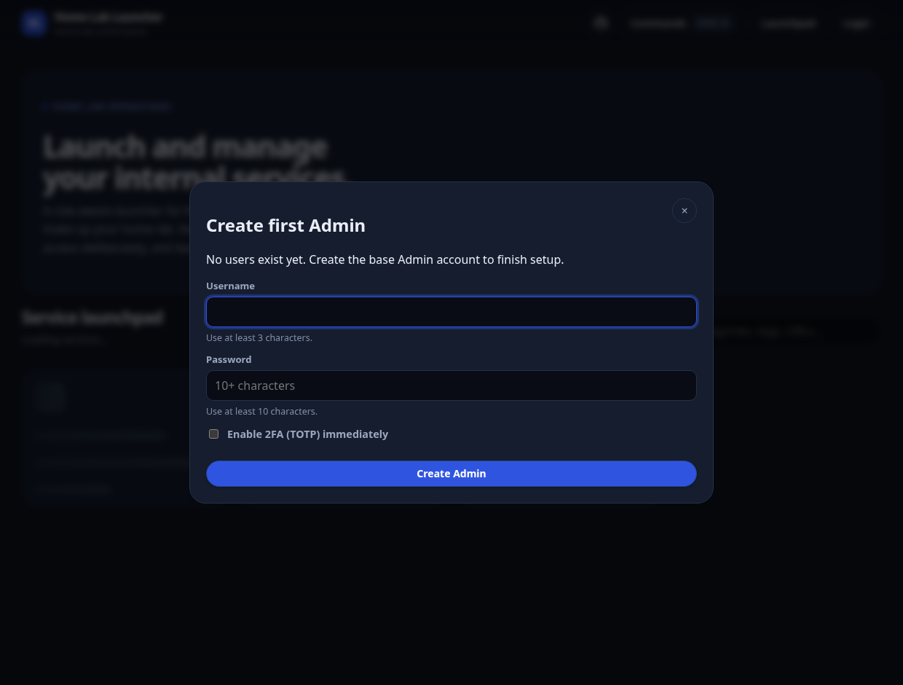

# Installation

Four ways to run Home Lab Launcher. Pick one:

| Method | Best for |
| --- | --- |
| [Guided installer](#guided-installer-linux--macos) | Fastest path on Linux/macOS with Docker |
| [Docker Compose](#docker-compose) | Most home labs — easy upgrades and persistence |
| [Docker (single container)](#docker-single-container) | Quick trials, or hosts you manage with plain `docker run` |
| [Local (from source)](#local-from-source) | Bare-metal / no-Docker hosts, development |

Every method needs a `SESSION_SECRET` — a long random string. Generate one first:

```bash
openssl rand -hex 48
```

## Guided installer (Linux / macOS)

Requires Docker with Compose v2. The installer prompts for the basics, writes `docker-compose.yml` + `.env` into an install directory, and can start the launcher for you.

```bash
# Linux
curl -fsSL https://raw.githubusercontent.com/TMASoft/home-lab-launcher/main/install/linux.sh | sh

# macOS
curl -fsSL https://raw.githubusercontent.com/TMASoft/home-lab-launcher/main/install/macos.sh | sh
```

Prefer to inspect scripts before running them? Download first, then run with `sh linux.sh`.

## Docker Compose

**1.** Clone and configure:

```bash
git clone https://github.com/TMASoft/home-lab-launcher.git
cd home-lab-launcher
cp .env.example .env
```

**2.** Edit `.env` — at minimum:

```env
SESSION_SECRET=paste-your-generated-secret
APP_BASE_URL=http://localhost:8080
```

**3.** Start from the published image (recommended):

```bash
APP_IMAGE=ghcr.io/tmasoft/home-lab-launcher:v0.9.6 docker compose pull launcher
APP_IMAGE=ghcr.io/tmasoft/home-lab-launcher:v0.9.6 docker compose up -d --no-build
```

Or build from source: `docker compose up --build -d`

Data persists in the `launcher-data` Docker volume.

## Docker (single container)

No checkout needed — one command:

```bash
docker run -d --name home-lab-launcher \
  --restart unless-stopped \
  -p 8080:8080 \
  -v launcher-data:/app/data \
  -e SESSION_SECRET="paste-your-generated-secret" \
  -e APP_BASE_URL="http://localhost:8080" \
  --cap-drop ALL \
  --security-opt no-new-privileges:true \
  ghcr.io/tmasoft/home-lab-launcher:v0.9.6
```

Check it:

```bash
docker logs -f home-lab-launcher
curl -fsS http://localhost:8080/api/healthz
```

Upgrade by stopping and removing the container, then re-running with a newer tag — the `launcher-data` volume keeps your data:

```bash
docker rm -f home-lab-launcher
# re-run the docker run command above with the new tag
```

Any variable from the [environment reference](../README.md#configuration) can be added with more `-e` flags.

## Local (from source)

Runs the Node.js server directly — no Docker. You need:

- **Node.js 22** (the supported LTS line)
- A C/C++ toolchain, Python 3, and `make` (to build the `better-sqlite3` native module)

**1.** Clone and install:

```bash
git clone https://github.com/TMASoft/home-lab-launcher.git
cd home-lab-launcher
npm ci --omit=dev
```

**2.** Create `.env` in the project root (don't copy `.env.example` verbatim — it contains Docker container paths):

```env
NODE_ENV=production
PORT=8080
SESSION_SECRET=paste-your-generated-secret
APP_BASE_URL=http://localhost:8080
```

Data is stored in `./data` by default; set `DATA_DIR=/path/to/data` to move it.

**3.** Start:

```bash
npm start
```

<details>
<summary><strong>Run as a systemd service (Linux)</strong></summary>

Create `/etc/systemd/system/home-lab-launcher.service` (adjust user and paths):

```ini
[Unit]
Description=Home Lab Launcher
After=network-online.target
Wants=network-online.target

[Service]
Type=simple
User=launcher
WorkingDirectory=/opt/home-lab-launcher
ExecStart=/usr/bin/node src/server/index.js
Restart=on-failure
NoNewPrivileges=true
ProtectSystem=strict
ReadWritePaths=/opt/home-lab-launcher/data

[Install]
WantedBy=multi-user.target
```

Then:

```bash
sudo systemctl daemon-reload
sudo systemctl enable --now home-lab-launcher
```

</details>

Upgrade with `git pull && npm ci --omit=dev`, then restart the process. Back up `./data` first.

## First login

Open `http://localhost:8080` (or your `APP_BASE_URL`). The first page load walks you through creating the Admin account — usernames need 3+ characters, passwords 10+, with optional TOTP 2FA right from setup.



Sanity checks:

```bash
curl -fsS http://localhost:8080/api/healthz           # { ok, version, uptimeSeconds }
curl -fsS http://localhost:8080/api/bootstrap-status  # is first-admin setup still needed?
```

Prefer non-interactive bootstrap? Set `BOOTSTRAP_ADMIN_USERNAME` and `BOOTSTRAP_ADMIN_PASSWORD` before first start, then change or remove that password after login.

## Next steps

- Reverse proxies, HTTPS, service discovery, hardening: [deployment.md](deployment.md)
- Upgrades: [upgrading.md](upgrading.md)
- Backups: [examples/backup-restore.md](examples/backup-restore.md)
